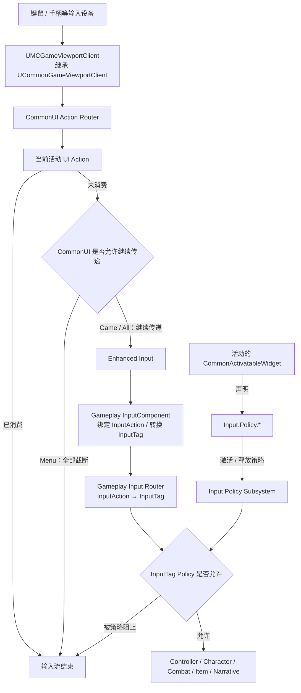

# MoldCasting 游戏设计与实现

本文档统一记录 MoldCasting 的游戏设计目标、核心框架、技术方案、实施路线、系统边界和验收要求。

## 1. 总体路线

MoldCasting 的核心游戏框架按以下九个领域进行组织，其中 Character、Controller、Camera 和 Combat 构成基础 4C：

1. Character
2. Controller
3. Camera
4. Combat
5. World
6. Narrative
7. Item
8. Input
9. UI

### 系统与技术方案总览

| 系统 | 主要方案 | 相关模块与说明 |
| --- | --- | --- |
| Character | Mover、GASP、Motion Matching | 使用 `Mover`、`NetworkPrediction`、`PoseSearch`、`Chooser` 和 `MotionWarping`。GASP 是参考工程和资源方案，不是 C++ 模块；Motion Matching 的核心运行时模块是 `PoseSearch`。 |
| Controller | StateTree | 使用 StateTree、Gameplay StateTree、AI Module 和 Navigation System 负责 AI 决策、状态组织与控制。PlayerController 和 AIController 消费来自 Input 或 AI 决策的控制意图；StateTree 不替代 PlayerController 或 AIController。 |
| Camera | JiajiaCamera | 以 `APlayerCameraManager`、Camera Modifier 和 Spring Arm 为基础，作为全项目唯一的镜头控制框架。 |
| Combat | Gameplay Ability System（GAS） | 使用 `GameplayAbilities`、`GameplayTags` 和 `GameplayTasks`，并可配合 `MotionWarping` 完成战斗动作对位。 |
| World | World Partition | 使用 World Partition、Data Layer、流式加载和 HLOD；PCG 作为后续可选方案。 |
| Narrative | Sequencer / Level Sequence | 使用 `LevelSequence`、`MovieScene` 和 `MovieSceneTracks`，按需接入 Control Rig 与 Contextual Animation。 |
| Item | Gameplay Interactions、Smart Objects、Chaos | 使用 Gameplay Interactions 和 Smart Objects 组织交互行为；使用 Chaos、Geometry Collection 和 Physics Core 支持物理与破坏，并衔接 Niagara 和声音表现。 |
| Input | Enhanced Input | 使用 `EnhancedInput` 组织 Input Action、Input Mapping Context、输入优先级、设备输入转换和按键重映射，并向其他系统输出统一的玩法意图。 |
| UI | CommonUI | 使用 CommonUI 组织界面层级、激活栈、输入路由、焦点和导航；底层按需使用 Common Input、UMG、Slate 与 SlateCore。 |

项目按以下六个阶段逐步实现。

### 第一阶段：角色移动与基本输入

- 完成移动、转向、视角和基本输入。
- 暂不接入动画，优先验证输入响应、加速度、移动惯性、制动和基础碰撞手感。
- 建立连续相机的基础控制权和生命周期。

### 第二阶段：接入 GASP

- 接入 Game Animation Sample Project（GASP）的 Motion Matching、动画数据库和运动逻辑。
- 完成项目角色的动画重定向。
- 动画表现不得破坏第一阶段已经确定的移动手感。

### 第三阶段：动作战斗框架

- 建立攻击、连段、闪避、防御、受击、硬直、打断和命中反馈。
- 根据战斗系统需要接入 Gameplay Ability System（GAS）。
- GASP 负责动画运动表现，GAS 负责能力、状态和战斗规则，两者保持清晰的职责边界。
- 提前预留统一的命中与 Item 交互接口。

### 第四阶段：World 世界地图框架

- 建立 World Partition、Data Layer、流式加载、区域状态和存档结构。
- 地图加载、区域切换和状态恢复必须服从一镜到底约束，不得通过切镜掩盖加载过程。

### 第五阶段：Narrative 剧情表演框架

- 统一负责剧情状态、事件触发、对话和剧情流程。
- 建立游戏与演出之间的无缝控制权交接。
- 支持角色走位、交互动画、对话、表情和 Sequencer 协作。
- Narrative 可以驱动 Camera，但最终镜头控制权始终归 Camera。
- 表演开始、进行和结束必须延续同一台相机，不得产生剪辑意义上的新镜头或切镜。

### 第六阶段：Item 环境物品框架

- Item 是项目对环境物品领域的统一命名，并不只表示背包或可拾取物。
- 建立统一的环境物品与交互接口。
- 支持可交互物、物理物体、机关、可破坏物，以及相关的碰撞、碎片、声音、特效和持续状态。
- 将 Item 与 Combat、World 及 Narrative 打通。

### 贯穿约束

- **一镜到底**是从第一阶段开始执行的底层架构约束，全流程绝不切镜，场景遮挡也不得用于隐藏切镜。
- Item 框架虽然在第六阶段集中实现，但相关接口必须在 Combat 阶段提前预留，避免后期推翻战斗系统。
- 每个阶段必须先定义可独立验证的完成标准，再进入下一阶段。

## 2. Character

### 2.1 目标

待填写。

### 2.2 职责边界

待填写。

### 2.3 C++ 基础层

待填写。

### 2.4 AngelScript/Blueprint 扩展层

待填写。

### 2.5 数据与配置

待填写。

### 2.6 网络与生命周期

待填写。

### 2.7 测试与验收

待填写。

### 2.8 待确认事项

待填写。

## 3. Controller

### 3.1 目标

待填写。

### 3.2 职责边界

待填写。

### 3.3 C++ 基础层

待填写。

### 3.4 AngelScript/Blueprint 扩展层

待填写。

### 3.5 数据与配置

待填写。

### 3.6 网络与生命周期

待填写。

### 3.7 测试与验收

待填写。

### 3.8 待确认事项

待填写。

## 4. Camera

### 4.1 目标

待填写。

### 4.2 职责边界

待填写。

### 4.3 C++ 基础层

待填写。

### 4.4 AngelScript/Blueprint 扩展层

待填写。

### 4.5 数据与配置

待填写。

### 4.6 网络与生命周期

待填写。

### 4.7 测试与验收

待填写。

### 4.8 待确认事项

待填写。

## 5. Combat

### 5.1 目标

待填写。

### 5.2 职责边界

待填写。

### 5.3 GAS 接入与战斗系统封装

待填写。

### 5.4 C++ 基础层

待填写。

### 5.5 AngelScript/Blueprint 扩展层

待填写。

### 5.6 数据与配置

待填写。

### 5.7 网络与生命周期

待填写。

### 5.8 测试与验收

待填写。

### 5.9 待确认事项

待填写。

## 6. World

### 6.1 目标

建立支持一镜到底体验的世界地图组织、加载、状态管理和持久化框架。

### 6.2 职责边界

- 负责 World Partition、Data Layer、区域组织和流式加载。
- 负责世界状态、对象生成、区域恢复和存档衔接。
- 不负责具体剧情流程、战斗规则或环境物品行为。

### 6.3 C++ 基础层

待填写。

### 6.4 AngelScript/Blueprint 扩展层

待填写。

### 6.5 数据与配置

待填写。

### 6.6 网络与生命周期

待填写。

### 6.7 测试与验收

待填写。

### 6.8 待确认事项

待填写。

## 7. Narrative

### 7.1 目标

建立统一的剧情与表演框架，在不切镜的前提下完成剧情推进、角色表演和玩法衔接。

### 7.2 职责边界

- 负责剧情状态、事件触发、对话、剧情流程和表演编排。
- 负责角色走位、交互动画、表情、Sequencer 协作及玩法与表演之间的控制权交接。
- 可以向 Camera 提交镜头意图，但不得绕过 Camera 直接切换视点或制造隐藏切镜。
- 不负责 Camera 的最终镜头计算、Combat 的战斗规则或 World 的地图流送。

### 7.3 C++ 基础层

待填写。

### 7.4 AngelScript/Blueprint 扩展层

待填写。

### 7.5 数据与配置

待填写。

### 7.6 网络与生命周期

待填写。

### 7.7 测试与验收

待填写。

### 7.8 待确认事项

待填写。

## 8. Item

### 8.1 目标

建立统一的环境物品、环境交互和破坏框架。

### 8.2 职责边界

- `Item` 是本项目的环境物品领域名称，并不只表示背包、装备或可拾取物。
- 负责可交互物、物理物体、机关、可破坏物及其持续状态。
- 负责环境物品相关的碰撞、物理反馈、碎片、声音和特效衔接。
- 通过明确接口与 Combat、World 和 Narrative 协作，不直接承担战斗规则、地图流送或剧情编排。

### 8.3 C++ 基础层

待填写。

### 8.4 AngelScript/Blueprint 扩展层

待填写。

### 8.5 数据与配置

待填写。

### 8.6 网络与生命周期

待填写。

### 8.7 测试与验收

待填写。

### 8.8 待确认事项

待填写。

## 9. Input

### 9.1 目标

建立由 CommonUI 和 Enhanced Input 共同组成的统一输入框架，为玩家控制、战斗、交互、剧情表演和 UI 提供稳定、可仲裁的输入意图。

输入分为两个相互独立的实现层：

- **UI Input**：通过 CommonUI Action Router 响应输入，并决定当前物理输入是否继续传递。
- **Gameplay Input**：通过 Enhanced Input 生成带 GameplayTag 的语义输入，并在执行玩法行为前经过 InputTag 策略检查。

UI 不直接操作 Character、Combat 或其他 Gameplay 系统；Gameplay 也不查询 Widget 状态。双方只通过输入路由和策略层协作。

### 9.2 职责边界

- 负责 Input Action、Input Mapping Context、输入优先级、设备输入转换和按键重映射。
- 负责 UI Input 与 Gameplay Input 之间的输入流仲裁。
- 负责根据 GameplayTag 输入策略，逐项允许或阻止 Gameplay 语义输入。
- 负责根据玩法、剧情表演和 UI 状态切换或叠加输入上下文。
- 向 Controller、Character、Combat、Item 和 Narrative 输出经过仲裁的玩法意图。
- 不直接执行角色移动、战斗能力、环境交互、剧情流程或界面业务逻辑。

### 9.3 输入流与仲裁



输入存在两层相互补充的截断机制：

1. **物理输入消费**：CommonUI Action Binding 通过 `bConsumeInput` 决定当前按键或轴输入是否继续传入 Enhanced Input。
2. **Gameplay 语义输入阻止**：Gameplay Input Router 根据 InputTag 判断某项玩法意图是否允许执行。

例如，背包界面可以消费用于 UI 导航的十字键，允许未消费的鼠标移动继续控制镜头，同时通过 InputTag 策略阻止攻击和环境交互。

#### CommonUI 物理输入消费

`InputComponent` 绑定某个 Gameplay Input Action，只表示输入流到达 Enhanced Input 后由该组件接收，不代表它会先于 UI 获得物理输入。项目使用 `UMCGameViewportClient` 继承 `UCommonGameViewportClient` 后，物理输入首先由 Viewport 转交给本地玩家的 `UCommonUIActionRouterBase`：

```text
UCommonGameViewportClient::InputKey
→ UCommonUIActionRouterBase::ProcessInput
→ 当前活动 UI Action Binding
→ Handled / BlockGameInput / Unhandled
```

CommonUI 提供以下核心 API：

- `UCommonUserWidget::RegisterUIActionBinding`：注册 Widget 所拥有的 UI Action。
- `FBindUIActionArgs::bConsumeInput`：决定匹配的 UI Action 是否消费本次物理输入，默认值为 `true`。
- `UCommonUIActionRouterBase::ProcessInput`：按当前 LocalPlayer、活动 Widget 树、输入模式、按键和输入事件执行路由。
- `ERouteUIInputResult`：返回 `Handled`、`BlockGameInput` 或 `Unhandled`。

当 UI Action 匹配并且 `bConsumeInput == true` 时，Action Router 返回 `Handled`。`UCommonGameViewportClient` 将结果转换为 `FReply::Handled()`，并从 `InputKey` 返回 `true`，不再调用 `Super::InputKey`。因此该物理事件不会进入 PlayerController、Enhanced Input 或 Gameplay InputComponent。

```text
SpaceBar
→ 匹配 UI.Action.Confirm
→ 执行 Confirm
→ bConsumeInput == true
→ Viewport 截断本次 SpaceBar 事件
→ IA_Jump 不触发
```

UI 不根据 `SpaceBar` 倒查 Gameplay Mapping，也不把 `UI.Action.Confirm` 转换为 `Input.Gameplay.Jump`。两者只是可能共享同一个物理按键，不存在语义映射关系。消费本次物理事件会自然阻止该事件产生的所有下游 Gameplay Action；Gameplay InputTag 策略则独立负责禁止某一类玩法意图。

#### 条件性消费

UI 可以根据当前界面状态决定同一个输入是否被消费：

- Widget 不在活动 CommonUI 输入树中时，其非 Persistent Action Binding 不响应也不消费输入。
- Widget 激活且对应 Binding 的 `bConsumeInput == true` 时，匹配输入由 UI 消费。
- `ECommonInputMode::All` 下，未被 UI 消费的输入继续进入 Gameplay。
- `ECommonInputMode::Menu` 下，即使没有 UI Action 处理输入，CommonUI 也会阻止正常 Gameplay 输入；需要按项放行时不得使用该模式。

对于同一个活动 Widget 内部的动态条件，UE 5.8 的 `FUIActionBindingHandle` 没有公开的 `SetConsumeInput`。应当在条件变化时通过 `RegisterUIActionBinding` 和 `FUIActionBindingHandle::Unregister` 注册或注销消费型 Binding，或者将不同输入状态拆分为不同的 `UCommonActivatableWidget`。不得在 Tick 中反复注册，也不得直接修改 CommonUI 内部的 `FUIActionBinding::bConsumesInput`。

`FSimpleDelegate` 类型的 UI Action 回调没有“本次是否消费”的返回值，因此消费决定必须在事件到达前由活动 Widget 和 Binding 状态确定。只有确实无法提前确定的特殊输入规则，才考虑自定义 Action Router 或 Viewport 路由。

### 9.4 C++ 基础层

第一阶段已提供以下基础类型：

- `UMCGameViewportClient`：继承 `UCommonGameViewportClient`，确保 CommonUI Action Router 在 Gameplay Input 之前处理物理输入。
- `UMCInputPolicySubsystem`：基于 `ULocalPlayerSubsystem`，管理当前玩家的活动输入策略、策略优先级和阻止的 Gameplay InputTag。
- `UMCGameplayInputRouter`：作为所有 Gameplay Input Action 的统一入口，在分发玩法意图前执行 InputTag 策略检查。
- `FMCInputPolicyDefinition`：描述策略标签、CommonUI 输入模式、鼠标捕获方式和被阻止的 Gameplay InputTag。
- `FMCInputPolicyHandle`：表示一次策略申请；UI 关闭或对象销毁时通过句柄安全释放，避免重复恢复或状态泄漏。

Gameplay Action 不直接绑定最终玩法行为：

```text
Input Action
→ Gameplay Input Router
→ InputTag Policy
→ Gameplay 系统
```

`UMCInputPolicySubsystem` 只理解 InputTag 和策略定义，不引用具体 Widget、Character、Combat 或 Item 类型。

#### Gameplay InputComponent

角色使用的 Gameplay InputComponent 是 Pawn 层的输入适配器，不是全局输入管理器，也不负责判断当前 UI 状态。其职责为：

- 绑定角色所需的 Enhanced Input Action。
- 将 `InputAction + TriggerEvent + Value` 转换为项目统一的 Gameplay InputTag 语义。
- 将输入提交给 `UMCGameplayInputRouter`，在策略允许后更新角色输入状态或分发玩法意图。
- 缓存移动、跳跃、蹲伏等 Mover 所需输入，并通过 `IMoverInputProducerInterface` 提供预测输入。
- 在失去控制权、策略截断或输入上下文切换时清理持续输入状态。

Gameplay InputComponent 不得：

- 查询活动 Widget、保存 Widget 引用或自行判断 UI 是否打开。
- 定义当前 Input Policy。
- 绕过 Gameplay Input Router 直接执行最终移动、战斗、交互或剧情行为。
- 复制原始设备输入；网络层只处理经过仲裁的移动输入或玩法请求。

角色不在 `BeginPlay` 中监听玩家设备输入。角色获得本地玩家控制权并由 Unreal 调用 `SetupPlayerInputComponent` 后，才初始化 Gameplay InputComponent、绑定 Input Action 并连接 Mover Input Producer。初始化必须保证幂等，重新控制角色时先清理旧绑定。

只有同时满足以下条件的角色才监听玩家输入：

- 角色由 `APlayerController` 控制。
- 角色属于本地玩家。
- `IsLocallyControlled()` 为 `true`。

远端模拟角色、AI 角色以及服务端上的非本地角色不绑定本地设备输入。角色在 `UnPossessed`、InputComponent `OnUnregister`、Controller 更换或 `EndPlay` 时停止监听，移除角色 Mapping Context、清除 Action Binding、重置输入状态并解除 Mover Input Producer。

### 9.5 AngelScript/Blueprint 扩展层

- 项目的 Common Activatable Widget 基类提供 `InputPolicyTag` 属性。
- Widget 激活时使用 `InputPolicyTag` 申请策略，停用时释放策略句柄。
- Root Layout 或 UI Manager 注册打开系统菜单等全局 UI Action。
- Common Activatable Widget 基类注册返回、确认等公共 UI Action。
- 背包、地图、对话等具体 Widget 只注册自身页面使用的 UI Action。
- 只有始终有效的系统级 UI Action 才能注册为 Persistent Action。

UI Action 的路由入口统一为 CommonUI Action Router，但 Action 的注册位置由其实际所有者决定，不集中维护全部页面输入。

### 9.6 数据与配置

#### Input Policy Tag

Widget 使用 GameplayTag 声明输入策略，策略标签通过数据配置解析为具体行为：

| PolicyTag | CommonUI 模式 | Gameplay Input 策略 |
| --- | --- | --- |
| `Input.Policy.Gameplay` | `Game` | 允许 Gameplay Input |
| `Input.Policy.Mixed.Inventory` | `All` | 阻止移动、战斗和交互，按需允许镜头 |
| `Input.Policy.Mixed.Dialogue` | `All` | 阻止战斗和交互，按需允许移动及镜头 |
| `Input.Policy.UIOnly.PauseMenu` | `Menu` | 阻止全部 Gameplay Input |

Widget 只声明 PolicyTag，不直接设置或移除 Gameplay Mapping Context，也不调用 Gameplay Input Component。

#### UI Action Tag

CommonUI 使用 `FUIActionTag` 标识逻辑 UI Action。`FUIActionTag` 是 `FGameplayTag` 的强类型派生，统一使用 CommonUI 要求的 `UI.Action.*` 根标签：

```text
UI.Action.Confirm
UI.Action.Back
UI.Action.NextTab
UI.Action.PreviousTab
```

UI Action Tag 负责描述界面操作，由 CommonUI 根据当前输入设备和按键配置解析为实际 `FKey`。UI 代码不得硬编码空格、回车、手柄面键等物理按键，也不得根据物理按键倒查 Gameplay InputTag。

#### Gameplay Input Tag

每个 Gameplay Input Action 必须关联一个语义标签：

```text
Input.Gameplay.Move
Input.Gameplay.Look
Input.Gameplay.Jump
Input.Gameplay.Interact
Input.Gameplay.Combat.Attack
Input.Gameplay.Combat.Dodge
Input.Gameplay.Combat.Block
```

策略既可以阻止单项输入，也可以通过父标签批量阻止。例如，阻止 `Input.Gameplay.Combat` 时，Attack、Dodge 和 Block 均不可执行；只阻止 `Input.Gameplay.Combat.Attack` 时，Dodge 和 Block 不受影响。

Gameplay Input 配置最终采用 `InputTag + InputAction` 的数据映射形式，避免每增加一种输入就扩展一个固定成员字段。

#### Mapping Context 优先级

Mapping Context 优先级使用统一的具名常量，不允许各 Widget 自行填写任意数值：

| 类型 | 优先级 |
| --- | ---: |
| Gameplay | `0` |
| UI | `1000` |
| System | `2000` |

`IMC_UI_*` 由 Common Activatable Widget 基类以 UI 优先级激活；`IMC_System_*` 只容纳打开系统菜单等必须始终优先的输入。需要截断低优先级映射的 UI Action 必须启用 Consume Input。

### 9.7 网络与生命周期

- 原始设备输入、CommonUI 路由和 Input Policy 均属于本地玩家，不进行网络复制。
- 通过策略检查后的 Gameplay 意图再进入 Character、Combat、Item 等各自的网络预测或服务器权威流程。
- Input Policy 采用申请句柄管理生命周期，不允许通过单一布尔值直接开关 Gameplay Input。
- 多个 UI 同时激活时，被阻止的 Gameplay InputTag 取活动策略的并集；CommonUI 模式、鼠标捕获和焦点配置由最高优先级的活动策略决定。
- Widget 停用、LocalPlayer 退出或世界切换时必须释放对应策略句柄。
- 进入全 UI 模式时清理已按下按键；恢复 Gameplay 时避免菜单关闭按键继续触发攻击、跳跃等玩法行为。
- 当策略新增对持续型 InputTag 的阻止时，Gameplay Input Router 必须主动取消对应输入并通知 InputComponent 将状态归零，不能等待可能已被 UI 消费的 Released 事件。
- UI 关闭并恢复 Gameplay 时，当前仍处于按下状态的按键必须等待释放后才能重新触发，避免关闭菜单的 Confirm 或 Back 同时触发 Jump、Attack 等玩法行为。

### 9.8 测试与验收

- 验证 CommonUI Action 回调始终先于 Enhanced Input Gameplay 回调。
- 验证 UI Action 消费输入后，同一物理输入不会触发 Gameplay。
- 验证 UI 消费物理输入时不查询 Gameplay Mapping，也不需要解析对应 Gameplay InputTag。
- 验证 `All` 模式下，UI 未消费且策略允许的输入可以正常流入 Gameplay。
- 验证同一 Widget 状态变化时，消费型 Binding 的注册和注销能够分别截断和放行同一个输入。
- 验证非活动 Widget 的非 Persistent Action Binding 不会响应或消费输入。
- 验证混合界面能够允许 Look，同时独立阻止 Move、Attack 或 Interact。
- 验证父 InputTag 可以批量阻止其所有子输入，单项 InputTag 不影响同级输入。
- 验证 `Menu` 模式下，即使没有 Widget 处理某个按键，该输入也不会进入 Gameplay。
- 验证多个 UI 策略叠加及乱序关闭时，输入状态能够正确恢复。
- 验证 UI 打开、关闭和焦点切换时不会产生残留按键、幽灵攻击或持续移动。
- 验证角色仅在本地玩家控制且完成 `SetupPlayerInputComponent` 后监听输入，并在失去控制权时彻底清理。
- 验证键鼠、手柄及不同 LocalPlayer 的输入策略彼此独立。

### 9.9 当前决策

- 使用 `UMCGameViewportClient` 继承 `UCommonGameViewportClient`，由 CommonUI 提供 UI 优先的物理输入路由。
- UI 通过 GameplayTag 声明输入策略，不直接依赖 Gameplay 实现。
- CommonUI Action Router 负责物理输入消费，Gameplay Input Router 负责语义 InputTag 策略检查。
- UI Action 使用 `UI.Action.*`，Gameplay Input 使用 `Input.Gameplay.*`；两者不互相转换，也不通过物理按键倒查。
- 条件性拦截由活动 Widget 和消费型 Action Binding 的生命周期控制；需要逐项放行的混合界面使用 `All` 模式。
- Gameplay InputComponent 在本地玩家的 `SetupPlayerInputComponent` 阶段开始监听，并作为 Enhanced Input 到 Gameplay Input Router 之间的角色输入适配器。
- Gameplay、UI 和 System Mapping Context 分别使用 `0`、`1000` 和 `2000` 的固定优先级。
- 所有 Gameplay Input 必须先通过统一路由，不允许 Input Action 直接执行最终玩法行为。

### 9.10 实现状态

第一阶段 C++ 输入基础框架已完成，并通过 Unreal Engine 5.8 `MoldCastingEditor Win64 Development` 编译：

- 已启用 CommonUI，并将 `UMCGameViewportClient` 配置为项目 Game Viewport Client。
- 已提供 `UMCInputSettings`、`UMCInputPolicySubsystem`、`UMCGameplayInputRouter`、策略定义和策略句柄。
- 已提供 Gameplay、Input Policy 和基础 UI Action Native GameplayTag。
- `UMCRoleInputComponent` 已接入 Gameplay Input Router，并在策略变化、失去控制权和组件注销时清理持续输入。
- `UMCRoleInputConfig` 已支持 `InputAction + InputTag` 数据映射；现有固定 Action 字段暂时保留为兼容回退，避免破坏已有角色输入资源。
- 已统一 Gameplay、UI 和 System Mapping Context 的具名优先级常量。

尚未完成的后续工作：

- Common Activatable Widget 项目基类及其 `InputPolicyTag` 自动申请/释放。
- 具体 UI Action、UI Mapping Context 和页面级条件消费配置。
- Input Policy 的自动化测试，以及实际 UI 页面中的 PIE 输入顺序与残留按键验收。

## 10. UI

### 10.1 目标

建立基于 CommonUI 的统一界面框架。UI 的生命周期归属于 GameInstance 和
GameViewport，不依赖任何 Gameplay Level，并允许 AngelScript 通过稳定的
C++ 接口实现易变的业务逻辑。

### 10.2 职责边界

- UI 框架不引用 Character、Combat、World、Narrative、Item 或具体 Level 类型。
- Gameplay 不负责创建、持有或销毁 RootWidget。
- 稳定的对象生命周期和容器管理由 C++ 实现；易变的页面业务由 AngelScript
  通过 `UMCGameInstance::UIService` 调用。
- 第一阶段不设计页面 Tag、Layer、页面栈或具体业务页面。

### 10.3 C++ 基础层

- `UMCUIService`：继承项目已有的 `UMCBaseService`，由 `UMCGameInstance`
  获取并调用 `Init()`、`OnStart()`。
- `UMCUIRootWidget`：继承 `UCommonUserWidget`，是游戏所有 UI 的唯一根容器。
- `UMCUIService` 是 RootWidget 的唯一创建者和生命周期管理者。
- RootWidget 使用 GameInstance 作为 Outer，并通过
  `UGameViewportClient::AddViewportWidgetContent` 直接挂载到 GameViewport。
- `UMCUIService` 提供 `CreateAndAddWidget`、`AddWidget`、`RemoveWidget`、
  `ClearWidgets` 和 `GetRootWidget` 等稳定接口。
- `UMCUIRootWidget` 使用原生全屏 Overlay 承载子 Widget，并按 ZOrder 排序。

### 10.4 AngelScript 扩展层

- `UMCUIService` 和 `UMCUIRootWidget` 不设计 AngelScript 子类。
- AngelScript 通过 `UMCGameInstance::GetInstance()` 获取 GameInstance，再访问
  `UIService`。
- AngelScript 只负责具体页面的打开、关闭、交互和其他易变业务逻辑。
- AngelScript 不负责 Service、RootWidget、GameViewport 或跨地图生命周期。

### 10.5 数据与配置

- 第一阶段不引入 UI Tag、页面注册表或 Layer 配置。
- 具体页面通过 `TSubclassOf<UUserWidget>` 传给 `CreateAndAddWidget`。
- `ZOrder` 只用于最基础的显示顺序；统一 Layer 规划留到后续阶段。

### 10.6 网络与生命周期

- UIService 是 `UGameInstanceSubsystem`，随 GameInstance 创建和销毁。
- RootWidget 由 GameInstance 持有，不使用 World、Level、GameMode 或
  PlayerController 作为 Outer。
- UIService 监听 GameViewport 创建和地图加载事件；Viewport 暂时不可用时保留
  RootWidget，Viewport 可用后再挂载。
- RootWidget 直接挂到 GameViewport，不注册为随 World 清理的普通 Viewport
  Widget，因此地图切换期间保持同一实例。
- 当前按单本地玩家设计；多人分屏属于后续扩展。

### 10.7 测试与验收

- `UMCUIService::ValidateRootWidget` 验证 RootWidget、GameInstance Outer 和
  GameViewport 挂载状态。
- `UMCUIService::BeginLevelIndependenceTest` 记录 RootWidget，切换到引擎入口地图
  `/Engine/Maps/Entry`，地图加载后验证 RootWidget 仍为同一实例。
- 开发环境可通过控制台命令 `MC.UI.TestLevelIndependence` 执行完整测试。
- 测试成功日志为 `UI_LEVEL_INDEPENDENCE_TEST_PASSED`。
- 该测试不依赖项目 Gameplay Level；UE 显示任何 UI 的最低前提仍是
  GameViewport 已创建。

### 10.8 待确认事项

- 页面 Layer、页面栈和模态规则。
- 页面标识及 UI Tag 体系。
- 具体页面与此前 Input Policy 的自动接入方式。
