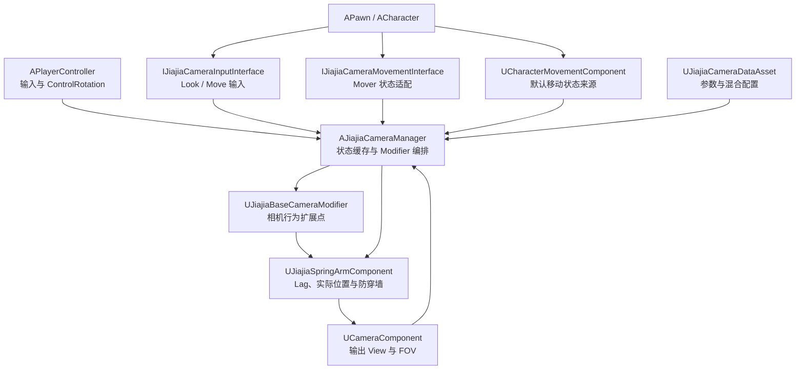
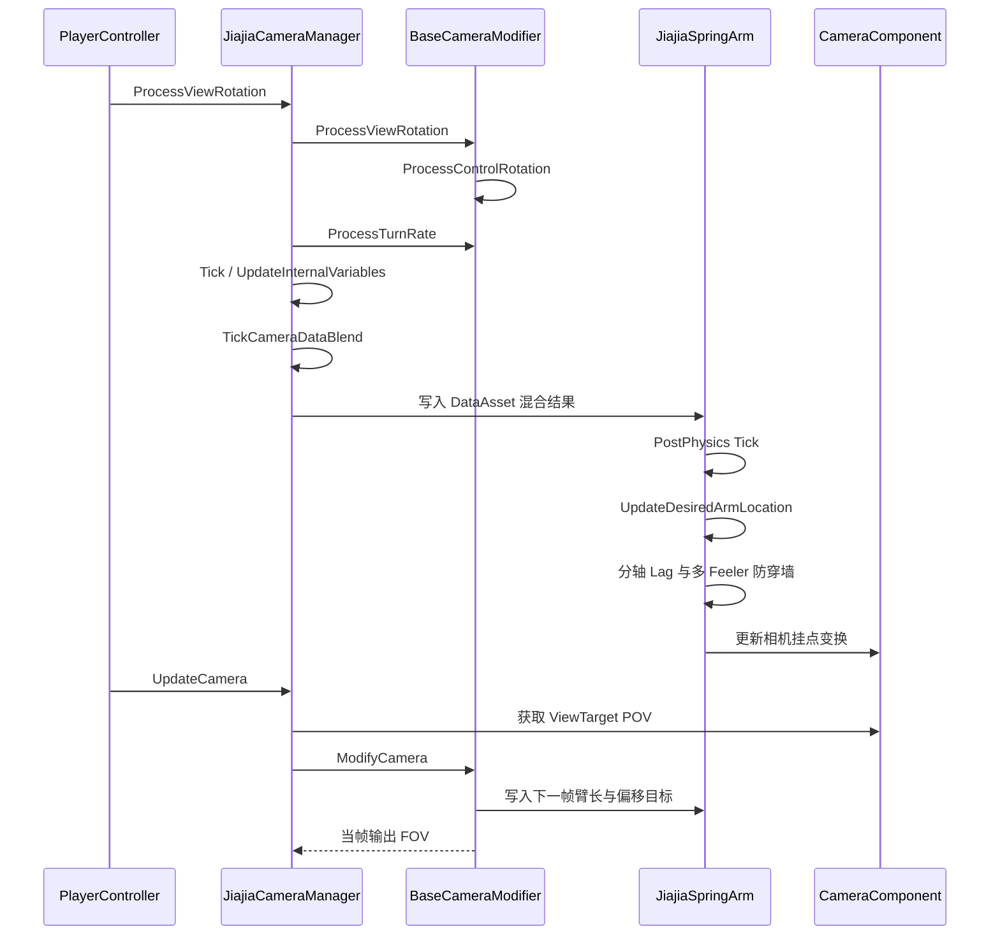
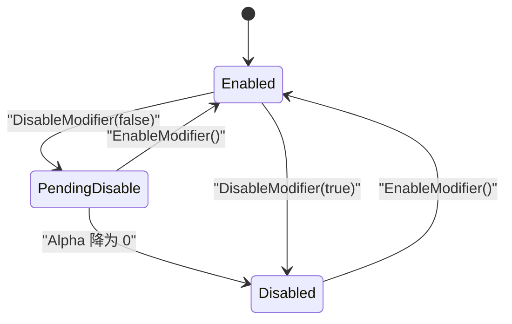
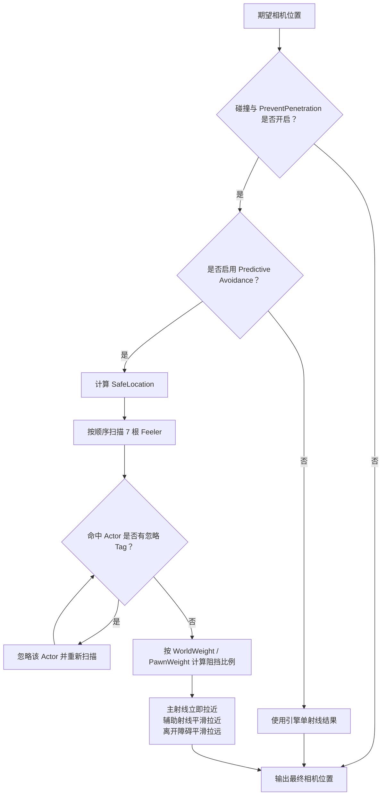
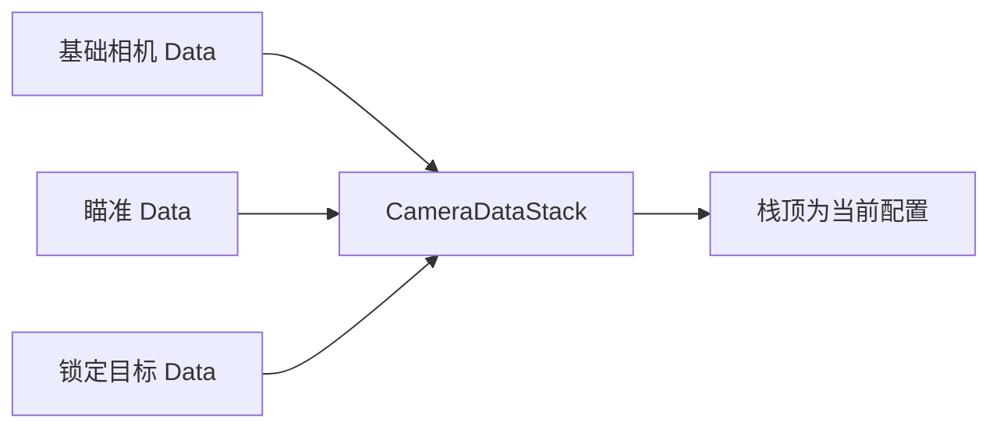
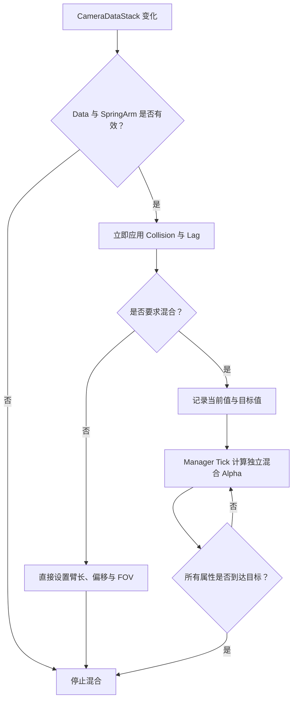
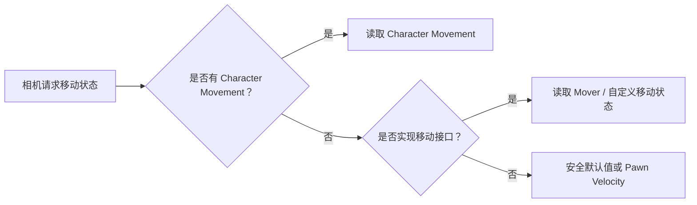
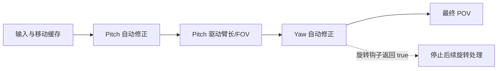
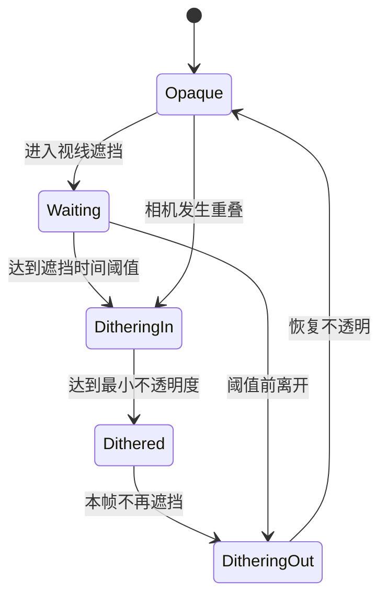
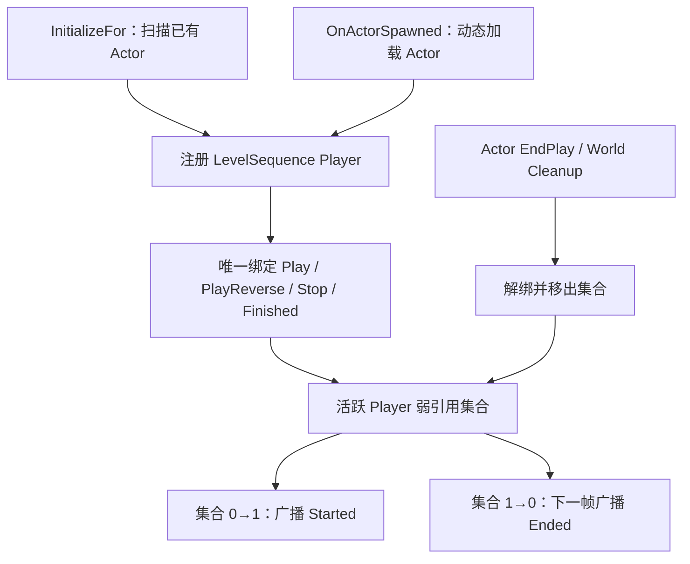

# JiajiaCamera 相机框架实现文档

> 文档状态：M1 框架已实现并通过 Unreal Engine 5.8 编译验证
>
> 所属插件：`Plugins/JiajiaUse`
>
> 所属模块：`JiajiaCamera`（Runtime）
>
> 当前边界：框架层已完成，尚未接入 MoldCasting 角色、PlayerController 和相机资产

---

## 1. 实现目标

`JiajiaCamera` 是一个第三人称相机运行时框架。它以
`APlayerCameraManager` 为编排中心，以 `UCameraModifier` 为行为扩展点，
并使用增强版 `USpringArmComponent` 处理实际相机位置、Lag 和防穿墙。

本阶段实现以下能力：

- 缓存当前 Pawn 的输入、速度和移动状态。
- 将相机行为拆分为可由 C++、AngelScript 或蓝图覆写的 Modifier 钩子。
- 支持水平与垂直速度分离的 Camera Lag。
- 支持带权重的多 Feeler 防穿墙和碰撞平滑。
- 支持相机 DataAsset 栈以及臂长、偏移、FOV 的运行时混合。
- 通过纯 C++ 接口适配 Character Movement、Mover 或其他移动方案。
- 为相机动画、玩法 Modifier、遮挡半透等后续功能提供稳定扩展点。

本阶段不包含：

- Pitch/Yaw 自动回正等具体玩法 Modifier。
- Enhanced Input Modifier。
- 遮挡物半透明。
- Camera Animation Sequence。
- LevelSequence 自动联动。
- `AMCRoleCharacter`、`AMCCameraManager` 和蓝图资产接入。

---

## 2. 模块位置与依赖

### 2.1 目录

```text
Plugins/JiajiaUse/
├── JiajiaUse.uplugin
└── Source/
    ├── JiajiaUse/
    └── JiajiaCamera/
        ├── JiajiaCamera.Build.cs
        ├── Public/
        │   ├── JiajiaCamera.h
        │   ├── Camera/
        │   │   ├── JiajiaCameraManager.h
        │   │   ├── JiajiaCameraTypes.h
        │   │   ├── Component/JiajiaSpringArmComponent.h
        │   │   ├── Data/JiajiaCameraDataAsset.h
        │   │   └── Modifier/JiajiaBaseCameraModifier.h
        │   └── Interface/
        │       ├── JiajiaCameraInputInterface.h
        │       └── JiajiaCameraMovementInterface.h
        └── Private/
            ├── JiajiaCamera.cpp
            └── Camera/
                ├── JiajiaCameraManager.cpp
                ├── JiajiaCameraTypes.cpp
                ├── Component/JiajiaSpringArmComponent.cpp
                └── Modifier/JiajiaBaseCameraModifier.cpp
```

### 2.2 模块依赖

`JiajiaCamera.Build.cs` 只公开依赖：

```csharp
"Core",
"CoreUObject",
"Engine"
```

核心模块不直接依赖：

- `Mover`
- `EnhancedInput`
- `LevelSequence`
- `MovieScene`
- `EngineCameras`

这些系统应通过工程适配层或后续扩展模块接入，从而避免相机框架与某一种移动、
输入或过场方案绑定。

---

## 3. 总体架构



### 3.1 职责划分

| 类型 | 职责 |
|---|---|
| `AJiajiaCameraManager` | 缓存 Pawn 状态、维护 Modifier 子集、限制局部 Yaw、管理 DataAsset 栈 |
| `UJiajiaBaseCameraModifier` | 把引擎 CameraModifier 生命周期转换成语义化钩子 |
| `UJiajiaSpringArmComponent` | 计算分轴 Lag、最终相机位置、多 Feeler 防穿墙 |
| `UJiajiaCameraDataAsset` | 保存纯相机参数，不保存玩法逻辑 |
| 输入接口 | 向 Manager 提供原始 Look 与 Move 输入 |
| 移动接口 | 在没有 Character Movement 时提供 Mover 或自定义移动状态 |

---

## 4. 每帧执行流程



### 4.1 关键时序

- `ProcessControlRotation` 只修改本帧 `DeltaRotation`，不直接设置 ControlRotation。
- Manager 的 DataAsset 混合发生在 SpringArm Tick 前，可以在当帧被 SpringArm 消费。
- Modifier 在相机更新阶段写入 SpringArm 属性时，SpringArm 已完成本帧 Tick，
  因而臂长与偏移通常在下一帧生效。
- Modifier 输出的 `OutFOV` 直接进入当前 POV，可以当帧生效。
- SpringArm 使用 `TG_PostPhysics`，能在角色和物理移动完成后计算相机位置。

---

## 5. AJiajiaCameraManager

### 5.1 状态缓存

Manager 每帧缓存：

| 状态 | 来源 |
|---|---|
| `OwnerPawn` | `PCOwner->GetPawn()` |
| `OwnerCharacter` | 当前 Pawn 转为 `ACharacter` |
| `CharacterMovementComponent` | Character 的移动组件 |
| `CameraSpringArmComponent` | `ResolveOwnerSpringArmComponent()` |
| `OwnerVelocity` | Character Movement、移动接口或 Pawn |
| `MovementInput` | 输入接口或覆写事件 |
| `RotationInput` | 输入接口或覆写事件 |
| 输入间隔时间 | 当前帧无输入时累加 |
| 水平与垂直 FOV | Camera Cache 的 FOV 与 AspectRatio |
| Pitch/Yaw TurnRate | Modifier 链计算结果，范围为 `[0, 1]` |

当 Pawn 被替换或解除 Possess 时，旧引用和缓存会被清理，不会继续读取上一个 Pawn。

### 5.2 SpringArm 选择

默认实现从 Pawn 上查找第一个 `USpringArmComponent`：

```cpp
USpringArmComponent* ResolveOwnerSpringArmComponent() const;
```

如果 Pawn 有多个 SpringArm，可采用以下任一方式明确选择：

- 在 Manager 子类中覆写 `ResolveOwnerSpringArmComponent`。
- Possess 后调用 `SetOwnerSpringArmComponent`。

`SetOwnerSpringArmComponent` 会验证组件是否属于当前 Pawn，避免绑定到无关 Actor。

### 5.3 Modifier 管理

Manager 覆写：

- `AddNewCameraModifier`
- `RemoveCameraModifier`

它在引擎的 `ModifierList` 之外维护一份
`UJiajiaBaseCameraModifier` 子集，避免每帧重复 Cast。

公开控制接口：

```cpp
SetJiajiaCameraModifiersEnabled(bool bEnabled, bool bImmediate);
SetJiajiaCameraModifierDebugEnabled(bool bEnabled);
FindCameraModifierOfClass(ModifierClass, bIncludeDerivedClasses);
```

### 5.4 局部 Yaw 限制

引擎默认按照世界空间限制 Yaw。框架覆写 `LimitViewYaw`，将限制区间转换为
相对当前 Pawn 朝向的局部范围：

```text
局部最小 Yaw = PawnYaw + ViewYawMin
局部最大 Yaw = PawnYaw + ViewYawMax
```

没有 Pawn 时自动退回引擎原始实现。

---

## 6. UJiajiaBaseCameraModifier

### 6.1 扩展钩子

| 钩子 | 执行阶段 | 用途 |
|---|---|---|
| `OnModifierEnabled` | Modifier 启用 | 保存启用前状态 |
| `OnModifierDisabled` | Modifier 禁用 | 清理或记录退出状态 |
| `ProcessControlRotation` | ControlRotation 更新 | Pitch/Yaw 回正、锁定目标 |
| `ProcessBoomLengthAndFOV` | Camera Modifier 阶段 | 调整臂长和 FOV |
| `ProcessBoomOffsets` | Camera Modifier 阶段 | 调整肩位与目标偏移 |
| `PostUpdate` | Modifier 末尾 | 其他收尾逻辑 |
| `ProcessTurnRate` | Manager 旋转阶段 | 软角度限制、输入减速 |
| `OnViewTargetChanged` | 切换 ViewTarget | 让位给其他相机 |
| `OnCameraTransitionStarted` | 外部过场开始 | 禁用玩法相机行为 |
| `OnCameraTransitionEnded` | 外部过场结束 | 恢复玩法相机行为 |

所有玩法钩子都是 `BlueprintNativeEvent`，因此可以在以下层实现：

- C++
- AngelScript
- 蓝图

### 6.2 安全行为

基础 Modifier 的默认实现会原样透传所有输出：

```text
OutFOV          = InFOV
OutArmLength    = InArmLength
OutSocketOffset = InSocketOffset
OutTargetOffset = InTargetOffset
OutDeltaRotation = InDeltaRotation
```

框架不会因为以下情况直接崩溃：

- CameraOwner 不是 `AJiajiaCameraManager`。
- 当前 Pawn 没有 SpringArm。
- ViewTarget 暂时不是当前 Pawn。
- Possess 切换过程中引用尚未刷新。

错误配置会写入 `LogJiajiaCamera`，Boom 相关钩子会被安全跳过。

### 6.3 Modifier 生命周期



引擎会更新 Modifier 自身的 `Alpha`，但 SpringArm 属性属于副作用写入，
具体玩法 Modifier 仍应显式用 `Alpha` 对臂长和偏移进行插值。

---

## 7. UJiajiaSpringArmComponent

### 7.1 分轴 Lag

组件提供：

```cpp
HorizontalCameraLagSpeed
VerticalCameraLagSpeed
```

规则如下：

- 某一项大于 `0` 时，使用该轴独立速度。
- 某一项等于 `0` 时，回退到 SpringArm 原生 `CameraLagSpeed`。
- 子步进和非子步进路径都使用相同的分轴算法。
- `CameraLagMaxDistance`、旋转 Lag、物理 DeltaTime 限制和调试标记仍保留。

当前“水平”指世界空间 X/Y，“垂直”指世界空间 Z。若项目以后支持动态重力，
需要改为基于角色 Up Vector 分解水平与垂直分量。

### 7.2 防穿墙流程



### 7.3 默认 Feeler

默认只保留几何上互不重复的 7 根扫描：

| # | Pitch | Yaw | WorldWeight | PawnWeight | Radius |
|---|---:|---:|---:|---:|---:|
| 0 | 0 | 0 | 1.00 | 1.00 | 15 |
| 1 | 0 | +5 | 0.20 | 0.75 | 15 |
| 2 | 0 | +10 | 0.20 | 0.75 | 15 |
| 3 | 0 | -5 | 0.20 | 0.75 | 15 |
| 4 | 0 | -10 | 0.20 | 0.75 | 15 |
| 5 | +15 | 0 | 0.50 | 1.00 | 10 |
| 6 | -10 | 0 | 0.50 | 0.50 | 10 |

主 Feeler 的旋转必须为零。运行时若配置错误，框架会记录错误并强制按零旋转扫描。

主 Feeler 对世界与 Pawn 的默认权重均为 `1`，确保正后方障碍能够完全阻止相机穿透；
辅助 Feeler 使用较低权重，让侧面和上下障碍产生更柔和的提前规避。

### 7.4 忽略碰撞

Actor 带以下 Tag 时会被相机碰撞忽略：

```text
JiajiaCamera_IgnoreCameraCollision
```

命中忽略对象后，组件会将它加入当前查询的忽略列表并重新扫描，而不是直接放弃该根
Feeler，因此仍能检测到忽略对象后方的实体墙面。

---

## 8. Camera DataAsset

### 8.1 数据结构

`UJiajiaCameraDataAsset` 当前包含：

- Arm Length
- Arm Offset
- Arm Lag
- FOV
- Pitch → Arm/FOV 曲线
- Collision
- Pitch Correction 参数
- Yaw Correction 参数
- Pitch Constraint 参数
- Yaw Constraint 参数

后四类玩法参数目前只作为数据定义存在，等待 M2 Modifier 消费。

### 8.2 DataAsset 栈



公开接口：

```cpp
PushCameraData(CameraData, bBlendCameraProperties);
PopCurrentCameraData(bBlendCameraProperties);
PopCameraData(CameraData, bBlendCameraProperties);
GetCurrentCameraDataAsset();
```

行为规则：

- Push 后，新 DataAsset 成为栈顶。
- 删除非栈顶元素不会改变当前相机。
- 删除栈顶元素后，自动应用新的栈顶。
- 空栈 Pop 会安全返回 `false`。
- 栈变化会调用 `OnCameraDataStackChanged`，工程可以继续覆写。

### 8.3 属性应用与混合



每类属性使用自己的时间和可选曲线：

- Arm Length Blend
- Socket Offset Blend
- Target Offset Blend
- FOV Blend

没有曲线时使用线性 Alpha；曲线输入约定为 `[0, 1]`。

当前框架把 `MinArmLength` 和 `MinFOV` 作为 DataAsset 的基础目标。
M2 的 Pitch 曲线 Modifier 实现后，可以根据 Pitch 将它们映射到 Min/Max 范围。

---

## 9. 输入与移动接口

### 9.1 输入接口

```cpp
class IJiajiaCameraInputInterface
{
public:
	virtual FVector2D GetCameraLookInput() const = 0;
	virtual FVector GetCameraMoveInput() const = 0;
};
```

轴向约定：

```text
LookInput.X  → Yaw
LookInput.Y  → Pitch
MoveInput.X  → 前后
MoveInput.Y  → 左右
MoveInput.Z  → 上下或自定义用途
```

### 9.2 移动接口

```cpp
class IJiajiaCameraMovementInterface
{
public:
	virtual FVector GetCameraVelocity() const = 0;
	virtual bool IsCameraFalling() const = 0;
	virtual bool IsCameraStrafing() const = 0;
	virtual bool IsCameraOnGround() const = 0;
	virtual bool IsCameraCrouching() const = 0;
	virtual bool IsCameraStanding() const = 0;
};
```

查询优先级：



这两个接口是纯 C++ 接口，不是 BlueprintNativeEvent。当前 MoldCasting 使用 Mover，
因此角色侧必须真实返回 Mover 状态，不能使用固定 `false` 占位。

---

## 10. MoldCasting 接入方案

以下步骤尚未实施，是下一阶段的工程侧接入清单。

### 10.1 添加模块依赖

在 `MoldCastingBasic.Build.cs` 中加入：

```csharp
"JiajiaCamera"
```

如果公开头文件直接继承或引用 JiajiaCamera 类型，应放在
`PublicDependencyModuleNames`。

### 10.2 CameraManager 继承

将工程侧空壳：

```cpp
class AMCCameraManager : public APlayerCameraManager
```

改为：

```cpp
class AMCCameraManager : public AJiajiaCameraManager
```

然后让实际 PlayerController 的 `PlayerCameraManagerClass` 指向
`AMCCameraManager` 或其蓝图/脚本子类。

### 10.3 角色接口

让 `AMCRoleCharacter` 实现：

```cpp
public IJiajiaCameraInputInterface,
public IJiajiaCameraMovementInterface
```

输入可从 `UMCRoleInputComponent::GetInputState()` 读取：

```cpp
FVector2D AMCRoleCharacter::GetCameraLookInput() const
{
	const UMCRoleInputComponent* RoleInputComponent = GetRoleInputComponent();
	return RoleInputComponent
		? RoleInputComponent->GetInputState().LookInput
		: FVector2D::ZeroVector;
}

FVector AMCRoleCharacter::GetCameraMoveInput() const
{
	const UMCRoleInputComponent* RoleInputComponent = GetRoleInputComponent();

	if (!RoleInputComponent)
	{
		return FVector::ZeroVector;
	}

	const FVector2D MoveInput = RoleInputComponent->GetInputState().MoveInput;
	return FVector(MoveInput.Y, MoveInput.X, 0.0f);
}
```

移动状态应从 `UMCRoleMoverComponent` 读取：

```cpp
GetVelocity()
IsFalling()
IsOnGround()
IsCrouching()
```

Strafe 状态可以结合输入中的：

```text
bStrafePressed || bAimPressed
```

Standing 可定义为：

```text
IsOnGround() && !IsCrouching()
```

### 10.4 相机组件

在角色构造函数中创建：

```cpp
UJiajiaSpringArmComponent
UCameraComponent
```

推荐初始值：

| 属性 | 值 |
|---|---:|
| `TargetArmLength` | 300 |
| `SocketOffset` | `(0, 50, 0)` |
| `TargetOffset` | `(0, 0, 70)` |
| `CameraLagSpeed` | 8 |
| `FieldOfView` | 80 |
| `bUsePawnControlRotation` | `true` |
| `bEnableCameraLag` | `true` |

角色本体建议：

```cpp
bUseControllerRotationPitch = false;
bUseControllerRotationYaw = false;
bUseControllerRotationRoll = false;
```

### 10.5 资产注意事项

蓝图 CameraManager、曲线和 Camera DataAsset 属于 `.uasset`。当前仓库忽略
`Content/`，因此这些资产不会随 Git 提交。接入时必须另外记录资产路径和分发方式。

---

## 11. 与原 BlazeCamera 方案的实现差异

| 原方案 | JiajiaCamera 实现 |
|---|---|
| 核心模块直接依赖 Mover、Enhanced Input、LevelSequence | 核心只依赖 Core、CoreUObject、Engine |
| SpringArm 缺失时 `check(false)` | 记录警告并安全跳过 Boom 钩子 |
| DataAsset 栈变化默认不应用 | 基类已实现参数应用和独立属性混合 |
| 策略 UObject 建议返回 `GWorld` | 当前框架不使用 `GWorld` |
| 分轴 Lag 只在子步进路径生效 | 子步进和非子步进路径一致 |
| 未配置的分轴速度回退到 `1` | 回退到原生 `CameraLagSpeed` |
| 默认 11 根 Feeler 中有 4 根几何重复 | 保留 7 根唯一 Feeler |
| Feeler 权重计算后被距离值覆盖 | World/Pawn 权重真实生效 |
| 忽略 Actor 后直接结束该 Feeler | 忽略后重新扫描后方障碍 |
| 主 Feeler 世界权重为 `0.5` | 主 Feeler 权重为 `1`，保证不穿墙 |
| AspectRatio 为零时仅 Ensure | 使用安全默认宽高比继续计算 |
| 取第一个 SpringArm，没有明确验证 | 支持事件覆写与带 Owner 验证的显式设置 |

---

## 12. 验证记录

验证日期：2026-07-28

构建命令：

```powershell
& 'D:\JiaXYTrunk\Engine\Build\BatchFiles\Build.bat' `
  MoldCastingEditor Win64 Development `
  '-Project=D:\JiaXYTrunk\Projects\MoldCasting\MoldCasting.uproject' `
  -WaitMutex `
  -NoHotReloadFromIDE
```

验证结果：

```text
UHT：通过
JiajiaCamera 编译：通过
UnrealEditor-JiajiaCamera.lib 链接：通过
UnrealEditor-JiajiaCamera.dll 链接：通过
Result: Succeeded
```

既存但与本模块无关的警告：

- 本机 UBT 配置中的 `bAllowUBALocalExecutor` 已弃用。
- 项目的 `StructUtils` 插件依赖已弃用。
- XGE Coordinator 未激活，构建自动使用 Standalone 模式。

---

## 13. 已知限制

1. 当前只完成框架，未接入实际 Pawn，因此还不能在 PIE 中观察第三人称镜头。
2. Modifier 写 SpringArm 属性存在一帧时序延迟。
3. DataAsset 混合和玩法 Modifier 如果同时写同一属性，必须明确优先级和启停时机。
4. 分轴 Lag 当前以世界 Z 为垂直方向，尚未完整支持动态重力。
5. 多 Feeler 每帧执行多次球扫，应通过 Profile 验证大量本地玩家或分屏场景。
6. 纯 C++ 输入/移动接口需要由工程 C++ 角色实现。
7. `UpdateDesiredArmLocation` 基于 UE 5.8 SpringArm 实现；升级引擎时必须对照新的引擎源码审查。
8. 相机过场目前只提供通知钩子，没有自动监听 LevelSequence。
9. 当前没有自动化测试；完成角色接入后需要通过 PIE 验收镜头手感和碰撞边界。

---

## 14. 后续实现规范

本章合并了原方案中仍有价值的 M2～M4 设计，但所有类名、依赖边界和生命周期约束均以
当前 `JiajiaCamera` 实现为准。本章内容属于**规划规范**，不是已完成代码。

### 14.1 状态说明

| 状态 | 含义 |
|---|---|
| 已完成 | 本文前半部分已有对应 C++ 实现并通过编译 |
| 待接入 | 框架能力已具备，但 MoldCasting 角色或资产尚未使用 |
| 待实现 | 仅保留设计与验收要求，代码尚不存在 |

### 14.2 M1.5：MoldCasting 工程接入

状态：**待接入**。

1. `AMCCameraManager` 继承 `AJiajiaCameraManager`。
2. `AMCRoleCharacter` 添加 `UJiajiaSpringArmComponent` 和 `UCameraComponent`。
3. 角色实现 `IJiajiaCameraInputInterface` 与 `IJiajiaCameraMovementInterface`。
4. PlayerController 使用新的 CameraManager。
5. 创建基础 `UJiajiaCameraDataAsset` 并压入数据栈。
6. 编译 C++，无头运行 `AngelscriptTest`，再进行 PIE 手感和 Output Log 验收。

### 14.3 M2：玩法 Modifier 与输入层

状态：**待实现**。

推荐执行顺序如下。旋转处理返回 `true` 会终止后续 Modifier，因此 Yaw 修正必须位于 Pitch
修正之后。



#### 14.3.1 Pitch 自动修正

新增 `UJiajiaPitchCorrectionCameraModifier`，覆盖 `ProcessControlRotation`。内部状态建议为：

```cpp
enum class EJiajiaPitchCorrectionState : uint8
{
	None,
	Moving,
	Slope,
	Falling
};
```

状态判定：

- `Moving`：有移动输入、角色在地面移动、没有旋转输入，且局部 Pitch 与
  `RestingPitch` 的差超过 `AngleThreshold`。
- `Slope`：启用坡面修正、存在移动输入、角色在地面，且坡度绝对值达到
  `MinimumSlopeAngle`。目标 Pitch 需要乘以视线与移动方向点积的符号。
- `Falling`：启用下落修正、角色正在下落、脚下存在地面，且离地距离达到
  `MinimumGroundDistanceWhenFalling`。

计时规则：

```text
有旋转输入或当前状态为 None：
    InputTimer = 0
否则：
    InputTimer += DeltaTime

RequiredDelay =
    Falling ? FallingInputDelay : InputDelay
```

只有计时达到阈值后才开始修正。目标增量应写入 `OutDeltaRotation`，不能在 Modifier 内直接调用
`SetControlRotation`：

```text
Speed = CorrectionSpeed × (Falling ? FallingSpeedMultiplier : 1)
TargetDeltaPitch = InDeltaPitch + Speed × DeltaTime × DirectionSign
OutDeltaRotation = RLerp(InDeltaRotation, TargetDeltaRotation, BlendAlpha, true)
```

玩家一旦重新输入视角，必须立即清零等待计时和混合计时。此 Modifier 返回 `false`，允许后续
Yaw 修正继续执行。

#### 14.3.2 Yaw 自动修正

新增 `UJiajiaYawCorrectionCameraModifier`，覆盖 `ProcessControlRotation`。同时满足以下条件才生效：

- 设置已启用；
- 有移动输入和有效速度；
- 角色不是 Strafing；
- 没有旋转输入，且等待时间达到 `InputDelay`；
- 移动方向不是近似纯前后；
- 局部 Yaw 既不接近正前方，也不接近正后方。

按夹角比例衰减修正速度：

```text
AngleScale = Clamp(Abs(LocalYaw) / 90, 0.001, 1)
TargetYaw = InDeltaYaw
          - CorrectionSpeed × DeltaTime × Sign(LocalYaw) × AngleScale
OutDeltaRotation = RLerp(InDeltaRotation, TargetDeltaRotation, BlendAlpha, true)
```

此 Modifier 在实际处理旋转后返回 `true`，防止其他旋转 Modifier 再次覆盖结果；未生效时返回
`false`。

#### 14.3.3 Pitch 驱动臂长与 FOV

新增 `UJiajiaPitchToArmAndFOVCameraModifier`，消费
`FJiajiaCameraPitchToArmAndFOVSettings`：

```text
PitchRatio = MapRangeClamped(
    ViewRotation.Pitch,
    [ViewPitchMin, ViewPitchMax],
    [-1, 1])

CurveArm = PitchToArmLengthCurve(PitchRatio)
CurveFOV = PitchToFOVCurve(PitchRatio)

TargetArm = MapRangeClamped(CurveArm, [-1, 1], Manager.ArmLengthRange)
TargetFOV = MapRangeClamped(CurveFOV, [-1, 1], Manager.FOVRange)
```

曲线定义域和值域都约定为 `[-1, 1]`。最终值通过 Modifier 的 `Alpha` 与输入值插值。Manager
不会替 Modifier 自动使用 `Alpha`。

若 Manager、曲线或 SpringArm 不可用，输出参数必须原样回写后再退出。禁止保留上一帧临时值。
在 Level Sequence、非 Owner ViewTarget 或相机动画期间，应暂停此 Modifier。

#### 14.3.4 蹲伏拉近

可选新增 `UJiajiaCrouchCameraModifier`：

```text
蹲伏：
    TargetFOV = DefaultFOV × CrouchingFOVMultiplier
    TargetArm = OriginalArmLength × CrouchingArmLengthMultiplier

站立：
    TargetFOV = DefaultFOV
    TargetArm = OriginalArmLength
```

状态切换时重新开始混合。该功能依赖角色正确实现 `IsCameraOwnerCrouching`；接口返回固定值时，
功能会静默失效，因此接入测试必须覆盖蹲伏与起身。

#### 14.3.5 Enhanced Input 适配

核心模块继续保持不依赖 `EnhancedInput`。如需要输入 Modifier，应放进单独的适配模块，例如
`JiajiaCameraEnhancedInput`：

| 输入 Modifier | 行为 |
|---|---|
| Turn Rate 缩放 | 输入值乘以 `AJiajiaCameraManager::GetCameraTurnRate()` |
| 转向加速 | 按持续输入时间查询归一化曲线，输入归零时重置计时 |

Boolean 输入直接放行。加速曲线时间轴约定为 `[0, 1]`；曲线无效时记录一次警告并返回原输入，
不能每帧刷屏。类名必须与实际职责一致。

#### 14.3.6 资产、开关与验收

- 创建 Pitch-to-Arm 与 Pitch-to-FOV 两条曲线。
- 每个玩法 Modifier 建立独立蓝图子类或数据配置。
- 默认顺序为
  `PitchCorrection → PitchToArmAndFOV → YawCorrection`。
- 每项功能提供 GameplayTag、CVar 或等价运行时开关，便于单项排查。

M2 验收：

- [ ] 抬头和低头时，臂长与 FOV 按曲线变化。
- [ ] 持续移动且停止视角输入后，Pitch 在等待时间结束后回到目标角度。
- [ ] 玩家再次输入视角时，Pitch/Yaw 自动修正立即停止。
- [ ] 斜向移动时 Yaw 朝移动方向修正，纯前后移动时不修正。
- [ ] 坡面、下落和蹲伏分支由真实移动接口驱动。
- [ ] 单独关闭任一功能开关时，其他 Modifier 不受影响。
- [ ] 输入加速曲线生效，Boolean 输入不被修改。

### 14.4 M3：POV 碰撞与遮挡半透明

状态：SpringArm 碰撞**已完成**；POV 碰撞替代方案与遮挡半透明**待实现**。

#### 14.4.1 两种碰撞路径必须互斥

默认使用 `UJiajiaSpringArmComponent` 的多 Feeler 防穿墙。只有相机不挂 SpringArm，或项目明确
需要在最终 POV 层处理碰撞时，才新增 `UJiajiaCollisionCameraModifier`。

POV 碰撞 Modifier 建议使用 `Priority = 134`、`bExclusive = true`。启动时检测：

```cpp
if (SpringArm
	&& SpringArm->bDoCollisionTest
	&& CollisionSettings.bPreventPenetration)
{
	// 记录错误并放弃 POV 碰撞，避免两套系统重复推挤镜头。
	return false;
}
```

POV 方案复用当前多 Feeler 的安全位置、权重和 BlendIn/BlendOut 逻辑，但直接修改
`InOutPOV.Location`。动画可通过成对的 `AddSingleRayOverrider` /
`RemoveSingleRayOverrider` 临时要求单射线检测。注册项使用弱引用，并在对象失效时自动清理。

#### 14.4.2 遮挡半透明

新增 `UJiajiaDitheringCameraModifier`，建议 `Priority = 255`，确保拿到最终相机位置。每帧可从
两条路径收集遮挡 Actor：

1. 相机附近球形 Overlap，用于镜头贴近物体。
2. 相机到安全位置之间的有向 Box Overlap，用于视线遮挡；默认关闭，按项目需要启用。

带 `JiajiaCamera_IgnoreDithering` Tag 的 Actor 跳过。是否包含 Owner、附着 Actor、Child Actor
都必须是显式配置。



每个 Actor 的运行时状态至少包含弱 Actor 引用、当前不透明度、遮挡累计时间、淡入/淡出状态和
遮挡类型。离开收集范围后必须淡出到 `1.0`，再回收状态。

材质实现约束：

- 材质提供统一标量参数，默认命名为 `Opacity`。
- 首次命中时缓存 Mesh 与动态材质实例，禁止每帧重新枚举和创建材质。
- 同一 Mesh 被多个本地相机影响时应采用引用计数或按相机合成目标值。
- `SetViewTarget`、地图卸载、Modifier 禁用和对象销毁时必须恢复材质。
- 可选通过 Material Parameter Collection 写入玩家位置，但全局 MPC 不适用于需要不同位置的分屏玩家。

M3 验收：

- [ ] SpringArm 防穿墙和 POV 碰撞不会同时运行。
- [ ] 相机贴近树木或柱子时物体渐隐，离开后完整恢复。
- [ ] 视线遮挡阈值、忽略 Tag、Owner 与附着对象开关均有效。
- [ ] 切换 ViewTarget、禁用 Modifier、卸载关卡后没有残留动态材质状态。
- [ ] Unreal Insights/Profile 中没有每帧创建动态材质实例。

### 14.5 M4：相机动画、换 Pawn 与 Level Sequence

状态：Manager 已有过场通知钩子，其余**待实现**。

#### 14.5.1 Camera Animation Sequence

新增相机动画 Modifier，使用 `UCameraAnimationSequencePlayer` 和
`UCameraAnimationSequenceCameraStandIn`。播放接口至少包含：

- Sequence 与播放参数；
- ResetType；
- 是否打断其他动画；
- 是否执行动画期间碰撞。

每个播放实例使用“槽位索引 + 自增序列号”组成 Handle，避免复用槽位后旧 Handle 误操作新动画。
缓入缓出总权重取 EaseIn/EaseOut 的较小值，动画位置和旋转以 ViewTarget 为基准叠加，FOV
按差值缩放，PostProcess 通过 CameraManager 的缓存接口混合。

ResetType 保留三种语义：

| ResetType | 动画缓出开始时的行为 |
|---|---|
| `BackToStart` | 回到动画开始前镜头，不修改 ControlRotation |
| `ResetToZero` | 回到角色背后；角色由 Controller Yaw 驱动时强制使用 |
| `ContinueFromEnd` | 非 Strafing 时让 ControlRotation 接续动画末帧 Pitch/Yaw |

动画需要碰撞时使用一根主 Feeler，并临时向碰撞系统注册 SingleRay Overrider。动画完成、打断、
Modifier 禁用或对象销毁时都必须成对移除 Overrider。

蓝图异步节点可暴露 `OnCompleted`、`OnEaseOut`、`OnInterrupted`。AnimNotify 等不适合异步
节点的调用方使用 Manager 上的非 Latent 播放接口。

#### 14.5.2 无跳变 Possess

提供成对接口：

```cpp
CameraManager->PrePossess(
	NewPawn,
	NewCameraData,
	bBlendCameraProperties,
	bMatchCameraRotation);

PlayerController->Possess(NewPawn);

CameraManager->PostPossess(bReplaceCurrentCameraData);
```

`PrePossess` 保存当前 ControlRotation 和最终 POV，并在需要混合时把当前臂长、SocketOffset、
TargetOffset 与 FOV 作为新 Pawn 的混合起点。`PostPossess` 刷新 Owner 引用、处理 DataAsset
栈并恢复匹配旋转，随后清空 Pending Payload。

约束：

- 两个接口必须成对使用，并对嵌套或遗漏调用记录错误。
- Pending Payload 中的 UObject 使用弱引用或 `UPROPERTY(Transient)`，不能留下悬空指针。
- 不要同时依赖该方案与 `SetViewTargetWithBlend` 完成同一段过渡；二者只能选一个状态所有者。

#### 14.5.3 Level Sequence 生命周期

旧方案“初始化时扫描一次并维护原始计数”不适用于 World Partition。新实现采用动态注册和集合：



实现契约：

- 初始化时扫描已有 `ALevelSequenceActor`，同时监听后续 Actor Spawn。
- 使用唯一绑定，重复 Refresh 不得重复添加委托。
- Actor EndPlay、World Cleanup 和 Manager 销毁时成对解绑。
- 使用活跃 Player 的弱引用集合，而不是可能失衡的整数计数。
- 同一 Player 的 Play 与 PlayReverse 只能占一个集合条目。
- Stop/Finished 后移除；当集合由非空变为空时，使用弱 Lambda 延迟到下一帧广播 Ended。
- World 正在 TearDown 时不再排队广播。
- Pause 仍属于播放中；具体是否暂停玩法 Modifier由产品规则决定，不能误判为 Ended。

M4 验收：

- [ ] 播放任一 Level Sequence 时相关玩法 Modifier 自动暂停。
- [ ] 最后一个 Sequence 结束后的下一帧，玩法 Modifier 恢复。
- [ ] 动态加载、反向播放、重复 Refresh、Stop、Finished 与关卡卸载不会造成重复事件。
- [ ] 相机动画完成和打断时回调各触发一次，SingleRay Overrider 不残留。
- [ ] 三种 ResetType 均能得到预期旋转与位置。
- [ ] `PrePossess → Possess → PostPossess` 后镜头不跳变，DataAsset 栈正确。

### 14.6 可选扩展

#### Focus

使用 Instanced 策略对象选择目标，在 `ProcessControlRotation` 中朝目标位置插值。可配置仅旋转
Yaw、忽略玩家输入、距离范围和 LOS 阻挡超时。策略对象的 `GetWorld()` 应从 Outer/Owner
解析，禁止返回全局 `GWorld`。

#### 软 Pitch/Yaw 约束

使用 `FJiajiaCameraPitchConstraintSettings` 和 `FJiajiaCameraYawConstraintSettings`。在靠近
边界的 `Tolerance` 区间内逐步降低 Turn Rate，到达边界后再由 Manager 的硬限制兜底。

#### DataAsset 覆盖 Lag

状态：**已实现基础覆盖**。当
`FJiajiaCameraArmLagSettings::bOverrideSpringArmSettings` 为真时，
`OnCameraDataStackChanged` 会立即同步 SpringArm 的 Lag 开关、速度和最大距离；碰撞设置也会
立即应用，不参与臂长/FOV 的插值。

当前栈顶 DataAsset 不要求覆盖 Lag 时，会保留 SpringArm 的现值。若后续需要“弹栈后严格恢复
下一层或角色初始 Lag”的完整栈语义，应保存角色初始快照，或从栈顶向下解析第一个有效覆盖源。

#### 相机穿透辅助接口

可为 ViewTarget 增加 `IJiajiaCameraAssistInterface`：

```cpp
class IJiajiaCameraAssistInterface
{
public:
	virtual void GetIgnoredActorsForCameraPenetration(
		TArray<const AActor*>& OutActors) const
	{
	}

	virtual AActor* GetCameraPenetrationTarget() const
	{
		return nullptr;
	}

	virtual void OnCameraPenetratingTarget()
	{
	}
};
```

只有在 SpringArm 或 POV 碰撞代码实际消费该接口后才添加公开 API，避免出现只有声明、没有
调用点的死接口。

---

## 15. Modifier 优先级与写入所有权

| Priority | 类型 | 说明 |
|---|---|---|
| `0` 附近 | 玩法 Modifier | Pitch/Yaw 修正、Pitch 曲线、蹲伏等 |
| `134` | POV 碰撞 Modifier | 可选，且与 SpringArm 碰撞互斥 |
| `255` | 遮挡半透明 Modifier | 读取最终镜头位置，最后执行 |

相同优先级时，`DefaultModifiers` 的顺序同样有语义。推荐：

```text
PitchCorrection
→ PitchToArmAndFOV
→ Crouch
→ YawCorrection
→ Collision（仅 POV 路径）
→ Dithering
```

同一帧中，同一个输出属性只能有一个明确的最终所有者。DataAsset 混合、Pitch 曲线和蹲伏若
同时写 ArmLength/FOV，应定义组合顺序或互斥条件，不能依赖“最后碰巧执行的类”。

---

## 16. 参数速查

### 16.1 当前已实现默认值

| 结构或对象 | 默认值 |
|---|---|
| `FJiajiaCameraArmLengthSettings` | Min `100`、Max `250`、BlendTime `0.5` |
| `FJiajiaCameraFOVSettings` | Min `90`、Max `125`、BlendTime `0.5` |
| `FJiajiaCameraArmOffsetSettings` | SocketOffset `(0,40,0)`、TargetOffset `(0,0,58)`、各 BlendTime `0.5` |
| `FJiajiaCameraArmLagSettings` | 默认不覆盖；Location Lag `true`、Rotation Lag `false`、速度 `8/10` |
| `FJiajiaCameraCollisionSettings` | BlendIn `0.05`、BlendOut `0.5`、Prevent/Predictive `true` |
| Manager | ArmRange `(50,300)`、FOVRange `(90,100)` |
| Manager 输入阈值 | Movement `0.1`、Rotation `0.01` |
| SpringArm 分轴 Lag | `0` 表示回退到原生 `CameraLagSpeed` |
| 碰撞忽略 Tag | `JiajiaCamera_IgnoreCameraCollision` |

### 16.2 当前默认 Feeler

默认只有 7 根几何唯一的 Feeler，权重会真实参与计算：

| # | AdjustmentRotation | WorldWeight | PawnWeight | Radius |
|---|---:|---:|---:|---:|
| 0 | `(0,0,0)` | `1.00` | `1.00` | `15` |
| 1 | `(0,+5,0)` | `0.20` | `0.75` | `15` |
| 2 | `(0,+10,0)` | `0.20` | `0.75` | `15` |
| 3 | `(0,-5,0)` | `0.20` | `0.75` | `15` |
| 4 | `(0,-10,0)` | `0.20` | `0.75` | `15` |
| 5 | `(+15,0,0)` | `0.50` | `1.00` | `10` |
| 6 | `(-10,0,0)` | `0.50` | `0.50` | `10` |

主 Feeler 必须保持零旋转，并使用 `1.0` 世界权重保证硬障碍不会被权重弱化到穿墙。

### 16.3 规划功能建议初值

这些值来自原方案，只作为 M2/M3 调参起点：

| 功能 | 建议初值 |
|---|---|
| Pitch 修正 | Speed `10`、InputDelay `2s`、RestingPitch `-10°`、Threshold `5°` |
| 下落 Pitch 修正 | Delay `0.5s`、GroundDistance `500`、SpeedMultiplier `6` |
| 坡面 Pitch 修正 | MinimumSlopeAngle `25°` |
| Yaw 修正 | Speed `50`、InputDelay `2s`、Threshold `10°` |
| 蹲伏拉近 | ArmMultiplier `0.8`、BlendTime `1s` |
| Dithering | MinimumOpacity `0.1`、In/OutSpeed `10`、SphereRadius `15` |

---

## 17. 实现契约与常见陷阱

1. Modifier 通过 `OutDeltaRotation` 修改旋转，不得在每帧钩子内直接
   `SetControlRotation`。
2. `ProcessControlRotation` 或 `ProcessTurnRate` 返回 `true` 会截断后续处理，顺序必须纳入设计。
3. Boom/FOV 钩子的所有退出分支都必须写回有效 Out 参数。
4. Modifier 的 `Alpha` 只表示启停权重，具体属性仍由实现自行插值。
5. SpringArm 多 Feeler 与 POV 碰撞 Modifier 二选一。
6. Feeler 以不含位置 Lag 的原始 Arm Origin 做扫描，避免越过矮墙时误推近。
7. Feeler `0` 必须是零旋转主射线；忽略命中 Actor 后要继续扫描其后方。
8. SpringArm 缺失是可恢复配置错误：记录警告并跳过对应处理，不能崩溃。
9. 宽高比为零时使用安全默认值，不能让 FOV 计算产生 NaN。
10. 输入和移动接口必须返回真实状态；固定返回 `false` 会使坡面、下落、蹲伏逻辑静默失效。
11. DataAsset、玩法 Modifier 同时写属性时必须定义所有权与组合顺序。
12. Level Sequence 结束通知延迟一帧；动态加载 Actor 必须被注册，委托必须成对解绑。
13. `PrePossess/PostPossess` 过渡与 `SetViewTargetWithBlend` 不能同时拥有同一次过渡。
14. 策略 UObject 从 Outer/Owner 获取 World，禁止使用 `GWorld`。
15. 当前垂直方向以世界 Z 为准；动态重力支持需要统一改造 Manager、Lag、碰撞与动画。
16. AngelScript 的 C++ `float&` 输出参数在脚本侧按 `float32&` 处理，必要时显式转换。
17. 动态材质实例只在首次使用时创建并缓存，任何退出路径都要恢复原状态。

---

## 18. 总体验收清单

### 框架与接入

- [x] `JiajiaCamera` 作为 `JiajiaUse` 插件的独立 Runtime Module 编译通过。
- [x] DataAsset 栈能够混合臂长、偏移和 FOV，并应用 Lag 与碰撞设置。
- [x] 分轴 Lag 在子步进和非子步进路径中行为一致。
- [x] 多 Feeler 碰撞使用有效权重，忽略 Actor 后会继续扫描。
- [ ] MoldCasting 的 CameraManager、角色、PlayerController 和资产完成接入。
- [ ] C++ 编译、AngelScript commandlet 与 PIE 全部通过。

### 镜头基础体验

- [ ] 鼠标和手柄能够转动视角，角色朝向规则符合玩法要求。
- [ ] 位置 Lag 平滑，瞬移后镜头能够按预期追上。
- [ ] 贴墙时快速拉近、离墙时平滑拉远。
- [ ] 越过矮墙时镜头不会被错误挤近。
- [ ] 切到非 Owner ViewTarget 时玩法 Modifier 正确暂停。

### M2～M4

- [ ] Pitch/Yaw 回正、坡面、下落、蹲伏和 Pitch 曲线全部通过 §14.3 验收。
- [ ] 遮挡半透明与可选 POV 碰撞通过 §14.4 验收。
- [ ] 相机动画、Possess 和 Level Sequence 通过 §14.5 验收。
- [ ] 开关、调试信息和 Output Log 能明确定位当前生效的相机功能。

---

## 19. 源码索引

- [`JiajiaCameraManager.h`](../Plugins/JiajiaUse/Source/JiajiaCamera/Public/Camera/JiajiaCameraManager.h)
- [`JiajiaBaseCameraModifier.h`](../Plugins/JiajiaUse/Source/JiajiaCamera/Public/Camera/Modifier/JiajiaBaseCameraModifier.h)
- [`JiajiaSpringArmComponent.h`](../Plugins/JiajiaUse/Source/JiajiaCamera/Public/Camera/Component/JiajiaSpringArmComponent.h)
- [`JiajiaCameraTypes.h`](../Plugins/JiajiaUse/Source/JiajiaCamera/Public/Camera/JiajiaCameraTypes.h)
- [`JiajiaCameraDataAsset.h`](../Plugins/JiajiaUse/Source/JiajiaCamera/Public/Camera/Data/JiajiaCameraDataAsset.h)
- [`JiajiaCameraInputInterface.h`](../Plugins/JiajiaUse/Source/JiajiaCamera/Public/Interface/JiajiaCameraInputInterface.h)
- [`JiajiaCameraMovementInterface.h`](../Plugins/JiajiaUse/Source/JiajiaCamera/Public/Interface/JiajiaCameraMovementInterface.h)
